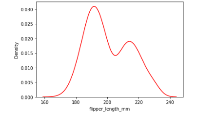

# Exploratory-Data-Analysis
**Introducing  Data Visualization to help explain data through various visualizations** 

## Overview

**Using the Penguins Dataset we developed numerous ways to visualize the dataset**

### Statastical Insights

**Penguins Dataset Statistical Insights**

### Boxplot

**Boxplots are a good way to check the outliers or understand the relationship between a categorical and continuous feature by showing the distribution of data.**

     

## Histogram

**Histograms are used to depict the frequency distribution. It can be only used with numerical data** 

         

## Kdeplot

**kdepot is another way to visualize the distribution of the data.**

 

## Resoures

- **[Kaggle](https://www.kaggle.com/datasets/parulpandey/palmer-archipelago-antarctica-penguin-data?select=penguins_size.csv)**

## Files

- **penguins_size.csv**

- **Exploratory Data Visualization.ipynb**
