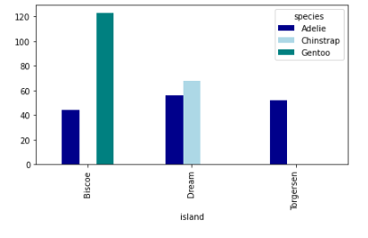

# Exploratory-Data-Analysis
**Introducing  Data Visualization to help explain data through various visualizations** 

## Overview

**Using the Penguins Dataset we developed numerous ways to visualize the dataset**

### Statastical Insights

**Penguins Dataset Statistical Insights**

### Boxplot

**Boxplots are a good way to check the outliers or understand the relationship between a categorical and continuous feature by showing the distribution of data.**

     

## Histogram

**Histograms are used to depict the frequency distribution. It can be only used with numerical data** 

         

## Kdeplot

**kdepot is another way to visualize the distribution of the data.**

 

## Bar Plot

**In a bar plot, the x-axis represents a categorical variable while the y-axis is a numerical variable. That is why the bar plot depicts a relationship between these two variables. For instance, below the body masses of the penguins for each islands are seen. The categorical data in the x-axis is the islands whereas the numerical data in y-axis is the body mass of the penguin.**

 

## Cross Tab

**Crosstab is a pandas function that displays the relationship between two or more variables that can be analyzed.**

 

## Count Plot

**A count plot is similiar to a bar plot but used for only categorical data. It plots the cout of observations by category in form of a bar plot. It differs from a bar plot because bar plots show the mean of a feature by category**

## Violin Plot

**Violin plots have common properties with box plots and used when the objective is to observe the distribution of numerical data for different categories.It gives more insights than a box plot, because two different categories might have the same mean but it doesn’t mean that they are the same. Their distributions might differ and in that case, violin plots would be more useful to observe.**

## Correlation Matrix

**Correlation Matrix is the summarization of the dataset. The matrix shows the correlations between features. In this dataset the relationship between `length of flipper` and `body mass` shows a correlation of 0.87, which is quite high.**

 

# Summary

**This dataset is quite small yet really useful in performing data analysis. The numerous and different visualizations play a key role in helping us understand the broader picture of datasets.**

## Resoures

- **[Kaggle](https://www.kaggle.com/datasets/parulpandey/palmer-archipelago-antarctica-penguin-data?select=penguins_size.csv)**

* **[Medium Article](https://mugekuskon.medium.com/how-to-perform-exploratory-data-analysis-5c3d944c13ff)**

## Files
 
- **penguins_size.csv**

- **Exploratory Data Visualization.ipynb**
